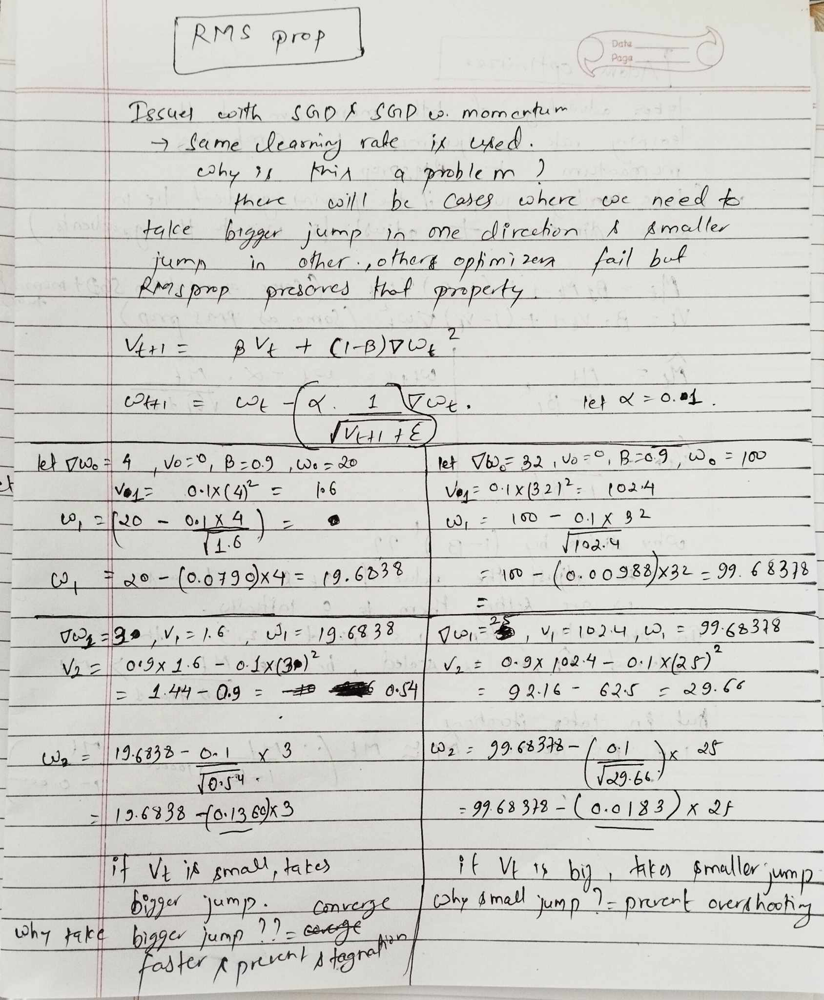

The simplest algorithm is the gradient descent in which we simply calculate loss over all the training data and then update our parameters, but it would be too slow and would consume too much resources. A faster approach is to use SGD where we calculate loss over every single training data and then do the parameter update, but the gradient update could be fuzzy. A more robust approach is to do mini batch SGD.

There are different types of optimizers with distinct capabilities.

### SGD with momentum

We have one addition in this optimizer i.e velocity term, it accumulates the velocity of previous gradient and move forward with that momentum. I've tried to see how it builds up velocity in the image below. As we can see gradient update depends not only on it's current gradient but also it's previous weights which provide the instance (t+1) with some momentum i.e gradient from previous steps (t, t-1, t-2 and so on). As we move towards higher iterations (t=100000) the effect of initial gradients i.e t=0, t=1 and so on becomes 0 because beta term is raised to the power t=100000, and only the closest gradients are fully taken into considerations. For instance, we can see in the image below how low priority is given to the previous weights i.e 0.729 to W0, and 0.081 to W1 and so on.

#### Weakness

- same learning rate is applied to all the parameters
- because of which the update to the parameters isn't precise.
  

### RMSprop

This optimizer tries to solve the problem of SGD with momentum i.e it tunes the learning rate based on it's gradient. It sets the effect of learning rate based on it's v term which is simply the accumulation of previous weights.

As you can see in the calculation done in left hand side the gradient accumulation i.e v is small so the effect of learning rate is bigger (we take bigger jumps), we take bigger jumps because we don't want our convergence to be too slow or to stagnate, so we take bigger jumps.

But when the gradient accumulation i.e v term is bigger (as shown in right hand side) we take smaller steps, because in those cases if we take a big jump we might miss the global minima, so the effect of learning rate in this case is decreased.

### Adam

This optimizer is simply the combination of both the momentum and RMSprop. It has its own speed determined by momentum and the learning rate adjustment provided by RMSprop.

The only modification is the addition of M hat and V hat i.e we scale of M and V, because initially we set the value of M and V to 0. The explanation about why we this is also provided in the image below.

