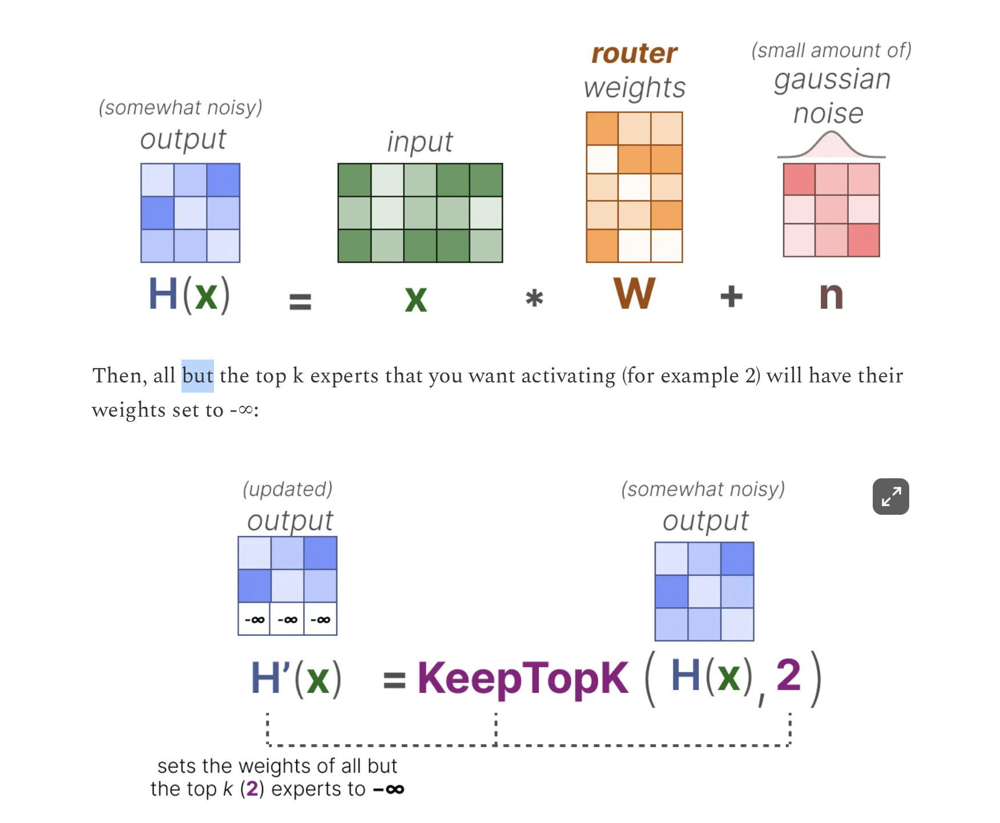
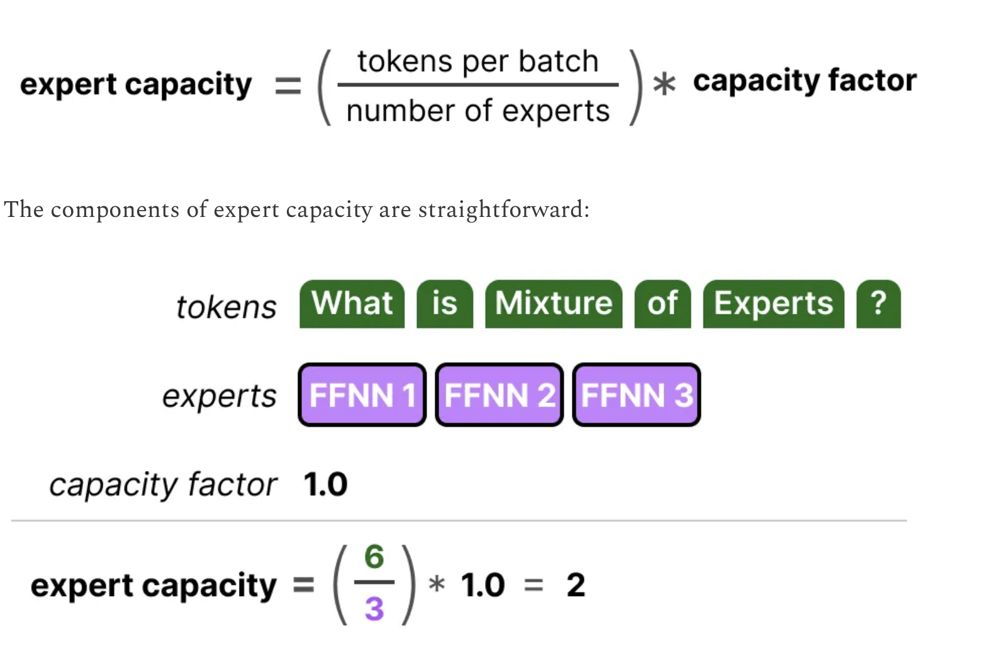
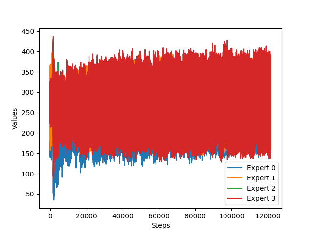

Image Source:
https://newsletter.maartengrootendorst.com/p/a-visual-guide-to-mixture-of-experts

## Basic MoE structure

- Experts are FFNN themselves, instead of passing input representation to only one dense FFNN we now have option to route them to more FFNNs.
  

Since most LLMs have several decoder blocks, a given text will pass through multiple experts before the text is generated.


Down the line it could use multiple experts but at different blocks i.e (layers)

A routing layer is set to choose experts


depending on how many experts are selected MoE are categorized into two i.e dense MoE in which almost all the experts are selected and sparse MoE only some experts are selected.

Not only will there be an uneven distribution of experts chosen, but some experts will hardly be trained at all. This results in issues during both training and inference.

Instead, we want equal importance among experts during training and inference, which we call **load balancing**. In a way, it’s to prevent overfitting on the same experts.

## Load Balancing

To balance the importance of experts, we will need to look at the router as it is the main component to decide which experts to choose at a given time.

#### KeepTopK

By introducing trainable (gaussian) noise, we can prevent the same experts from always being picked. It'll help router to distribute experts and not restrict to some specific experts.



### Capacity Factor

Distributing experts is not enough because distribution of expert happens close to no.of.steps times but there are a lot of batch of tokens that are processed in a single step. An expert could be assigned more than the others but it can also be assigned less tokens as compared to others.
The solution is to equally divide the number of tokens to all the expert using capacity factor given by this formula.


## Implementation

Now that we know what MoE is, let's implement it from scratch.

### Implementation of [Adaptive Mixture of Local Experts](https://www.cs.toronto.edu/~hinton/absps/jjnh91.pdf)

The MoE was defined as a set of independent **experts** (feed-forward networks) alongside a **gating network** (also a feed-forward network, ). All the experts and the gating network receive the same input . The gating network outputs the distribution of each expert relevance/importance for the given input and is defined as by Softmax(x@Wg) in its simplest form, where Wg  is a (optional) learnable transformation. Finally, the output of the system is the sum of the outputs of all experts weighted by the output of the gating network.

```python
from dataclasses import dataclass
torch.manual_seed(42)
@dataclass
class Config():
    n_embd:int = 10
    block_size:int = 5
    expert_size:int = 2
    vocab_size:int = 65

class Router(nn.Module):
    def __init__(self,config):
        super().__init__()
        self.config = config
        self.router = nn.Sequential(nn.Linear(self.config.n_embd,self.config.expert_size))
    def forward(self,x):
        return self.router(x)

class FFN(nn.Module):
    def __init__(self,config):
        super().__init__()
        self.config = config
        self.ffn = nn.Sequential(nn.Linear(self.config.n_embd, self.config.vocab_size))

    def forward(self,x):
        return self.ffn(x)


class MoE(nn.Module):
    def __init__(self, config):
        super().__init__()
        self.config = config
        self.router = Router(config)
        self.experts = nn.ModuleList([FFN(config) for _ in range(config.expert_size)])

    def forward(self, x):
#         we = self.we(x) # batch's embeddings (B,T,C)
        ep = self.router(x).softmax(dim=-1) # expert probability (B,T,E)
        ep = ep.unsqueeze(-1) # adding one dim to each of our experts, (B,T,E,1)
        exp_out = torch.stack([out(x) for out in self.experts], dim=-2) # (B,T,E,C)

        out = exp_out * ep # (B,T,E,C) x (B,T,E,1)
        out = out.sum(-2) # (B,T,C)

        return out

```

### Implementation of [OUTRAGEOUSLY LARGE NEURAL NETWORKS: THE SPARSELY-GATED MIXTURE-OF-EXPERTS LAYER](https://arxiv.org/pdf/1701.06538)

Using all the experts for inputs will be computationally expensive. A way to reduce that is to implement noise_gating + topK method specified in the paper [OUTRAGEOUSLY LARGE NEURAL NETWORKS: THE SPARSELY-GATED MIXTURE-OF-EXPERTS LAYER](https://arxiv.org/pdf/1701.06538)


let's understand these equation with reference to the code

```python
clean_logits = self.router(x) # corresponds to (x.W) in the equation 4
```

This is simply using the gating function to calculate the probability of experts for each input tokens. (this self.router(x) is an object of a class Router defined above)

```python
noise = torch.randn_like(clean_logits)*F.softplus(self.wnoise(x))
```

here torch.randn_like(clean_logits) resembles StandardNormal(), where we choose a random gaussian noise (mean = 0, std=1) to be added as a noise. Adding this will introduce some noise which encourages model to choose other experts.

self.wnoise is a noise but it's input dependent learnable parameter, because we don't want to choose experts completely randomly, instead it has to be input dependent, and it is learned during backprop.

and by adding F.softplus we are capping the output of noise to be greater than 0. it's approximately similar to relu.

```python
h = clean_logits + noise
```

we add the clean logits. and the noise, so we now encourage models to explore other experts too.

Now, let's make our MoE compute efficient i.e by choosing only the topK models for specific tokens.

```python
topk_val, topk_ind = torch.topk(h,self.config.top_k, dim = -1)
```

it will choose the topK experts for each token. topK is taken along the last dimension i.e -1 because experts probability is along the last axis. i.e h shape is (B,T,expert_size)

```python
out = torch.full_like(h, fill_value=float('-inf'))
out = out.scatter(dim=-1,index=topk_ind, src=topk_val)
out = torch.softmax(out, dim=-1)
```

we are now creating a new tensor with all the values with negative infinity and setting the topK values with their original values and for other there will be negative infinity. Now normalizing using softmax we get normalized probabilities and 0 in place of negative infinity.

now that we have our expert's probability for each input. Let's now pass the input through expert and take the weighted sum because we have topk probability assigned to a token input.

calculating weighted sum for the input tokens can be a difficult in terms of implementation.

The general idea is to iterate over all the experts to first create a mask from our router's output probabilities for each expert. (i.e creating a mask of True if this input probability in within topk for that specific expert) and flatten that mask, and pluck out the inputs from the flattened input
using that mask (mask will help us pluck out input tokens with specific index where mask value is true) and pass that plucked out input to the expert layer and then multiply the expert layer's output with the router's probability for that specific expert and then keep adding these values for all the experts because we are doing the weighted sum.

The code to do that is given below (it can take some time to understand, but it's relative easy if you understand this explanation)

```python
    def forward(self, x):
#         we = self.we(x) # batch's embeddings (B,T,C)
        out,topk_val,topk_ind = self.router(x) # out is size (B,T,experts) experts (B,T,top_k)

        flat_x = x.view(-1, x.shape[-1]) #(B*T,C)
        final_output = torch.zeros_like(flat_x) #


        for i,expert in enumerate(self.experts):
            expert_mask = (out[:,:,i] != 0) # (B,T)
            expert_mask = expert_mask.view(-1) # (B*T)

            if expert_mask.any(): # pass through expert layer only if flattened expert has any one true value
                select_x = flat_x[expert_mask]
                expert_x = expert(select_x) * (out[:,:,i]).view(-1)[expert_mask].unsqueeze(-1) #unsqueeze for broadcasting across columns
                final_output[expert_mask] += expert_x # add because our inp is combination of experts, i.e one token can take can top2 prob

        final_output = final_output.view(x.shape)

        return final_output
```

#### Full code til here

```python
class Router(nn.Module):
    def __init__(self,config):
        super().__init__()
        self.config = config
        self.router = nn.Sequential(nn.Linear(self.config.n_embd,self.config.expert_size))
        self.wnoise = nn.Linear(self.config.n_embd, self.config.expert_size)

    def forward(self,x):
        clean_logits = self.router(x)

        noise = torch.randn_like(clean_logits)*nn.Softplus(self.wnoise(x))
        h = clean_logits + noise

        topk_val, topk_ind = torch.topk(h,self.config.top_k, dim = -1)
        out = torch.full_like(h, fill_value=float('-inf'))
        out = out.scatter(dim=-1,index=topk_ind, src=topk_val)
        out = torch.softmax(out, dim=-1)

        return out,topk_val, topk_ind


class MoE(nn.Module):
    def __init__(self, config):
        super().__init__()
        self.config = config
        self.router = Router(config)
        self.experts = nn.ModuleList([FFN(config) for _ in range(config.expert_size)])

    def forward(self, x):
#         we = self.we(x) # batch's embeddings (B,T,C)
        out,topk_val,topk_ind = self.router(x) # out is size (B,T,experts) experts (B,T,top_k)

        flat_x = x.view(-1, x.shape[-1]) #(B*T,C)

        final_output = torch.zeros_like(flat_x)


        for i,expert in enumerate(self.experts):
            expert_mask = (out[:,:,i] != 0) # (B,T)
            expert_mask = expert_mask.view(-1) # (B*T)

            print(em_new == expert_mask)

            if expert_mask.any():
                select_x = flat_x[expert_mask]
                expert_x = expert(select_x) * (out[:,:,i]).view(-1)[expert_mask].unsqueeze(-1) #unsqueeze for broadcasting across columns
                final_output[expert_mask] += expert_x # add because our inp is combination of experts, i.e one token can take can top2 prob

        final_output = final_output.view(x.shape)

        return final_output
```

This implementation assigns expert for each no.of.steps in our training step, here even if the experts are assigned equally, the total number of tokens assigned to those expert could be different, for that reason we would want to distribute input tokens equally to all the experts. We can do that using expert capacity explained above in the Load Balancing section above.

#### Expert Capacity implementation

we define expert capacity as total number of tokens in a batch divided by number of experts times the capacity factor (which controls the scale).

```python
exp_cap = int(B*T*self.config.top_k / self.config.expert_size * self.config.capacity_factor)

```

select the indices of input where this specific expert is applied and limit the inputs to be processed to be within the expert capacity if it is greater than expert capacity and truncate other tokens.

```python
selected_indices = torch.nonzero(expert_mask).squeeze(-1)
limited_indices = selected_indices[:exp_cap] if selected_indices.numel() > exp_cap else selected_indices
```

#### Full implementation

```python
class Router(nn.Module):
    def __init__(self,config):
        super().__init__()
        self.config = config
        self.router = nn.Sequential(nn.Linear(self.config.n_embd,self.config.expert_size))
        self.wnoise = nn.Linear(self.config.n_embd, self.config.expert_size)

    def forward(self,x):
        clean_logits = self.router(x)

        noise = torch.randn_like(clean_logits)*F.softplus(self.wnoise(x))
        h = clean_logits + noise

        topk_val, topk_ind = torch.topk(h,self.config.top_k, dim = -1)
        out = torch.full_like(h, fill_value=float('-inf'))
        out = out.scatter(dim=-1,index=topk_ind, src=topk_val)
        out = torch.softmax(out, dim=-1)

        return out,topk_val, topk_ind


class MoE(nn.Module):
    def __init__(self, config):
        super().__init__()
        self.config = config
        self.router = Router(config)
        self.experts = nn.ModuleList([FFN(config) for _ in range(config.expert_size)])
	    self.wimportance = 1.0
    def forward(self, x):
#         we = self.we(x) # batch's embeddings (B,T,C)
        B,T,C = x.shape
        out,topk_val,topk_ind = self.router(x) # out is size (B,T,experts) experts (B,T,top_k)

        flat_x = x.view(-1, x.shape[-1]) #(B*T,C)

        final_output = torch.zeros_like(flat_x)

        exp_cap = int(B*T*self.config.top_k / self.config.expert_size * self.config.capacity_factor)


        for i,expert in enumerate(self.experts):
            expert_mask = (out[:,:,i] != 0) # (B,T)
            expert_mask = expert_mask.view(-1) # (B*T)

            selected_indices = torch.nonzero(expert_mask).squeeze(-1)

            limited_indices = selected_indices[:exp_cap] if selected_indices.numel() > exp_cap else selected_indices


            if expert_mask.any():

                select_x = flat_x[limited_indices]

                expert_x = expert(select_x) * (out[:,:,i]).view(-1)[limited_indices].unsqueeze(-1) #unsqueeze for broadcasting across columns

                final_output[limited_indices] += expert_x # add because our inp is combination of experts, i.e one token can take can top2 prob

        final_output = final_output.view(x.shape)

        # Importance scores for experts i.e batchwise sum of the router's output
        importance = out.sum(dim=0)

        # loss that needs to be added to encourage model to choose diverse experts
        imp_std,imp_mean = importance.std(), importance.mean()

        loss_moe = ((imp_std/imp_mean)**2)*self.wimportance


        return final_output,loss_moe
```

#### Auxiliary Loss


To encourage models to make expert's probability uniform (choosing all the experts and not restricting to some experts) We add to our main loss another loss term that we get from our MoE layer. It is calculated by first calculating the importance which is simply calculating the batch sum over the inputs for the router's output and calculating the square of the coefficient of variation from the importance and then multiplying with a hand tuned scaling factor called Wimportance.

The implementation from this auxiliary loss is already implemented in the code above.

### Visualizations

what's the point of adding the MoE losses and noises if we can't visualize it's effect. I've trained my GPT + MoE architecture with variations to visualize what they actually do.

#### No Noise and No MoE loss

I did not add the noise term i.e in the equation 4 in the picture above and did not add MoE loss to our original loss function.

x axis = no of steps
y axis = no of tokens assigned to each expert


Even though the plot seems to fluctuate too much, we can see that there is inappropriate distribution of tokens among the experts i.e expert 0 is assigned less tokens and and expert 1 and 3 are assigned more tokens and the curve relatively stays the same because we did not add the loss function too.

#### Noise but no MoE loss



There is relatively small gap between number of tokens assigned to the experts because this time we added gaussian noise which reduces the gap, but the number of tokens assigned to them remains constantly fluctuating.

#### No Noise but MoELoss included


As you can see there was inappropriate distribution of tokens in the beginning but the model seems to have learned to distribute the tokens among the experts after training for some time.

#### Including Noise and MoE Loss


it looks similar to the previous one, i.e big variation in the beginning but learns to distribute afterwards, its different from the previous one in that initially the range of tokens assigned to experts are between (150, 350) but in the previous plot it was (100,400). This less variation in this plot can be attributed to the addition of gaussian noise.

In conclusion, addition of loss seems to be more important than including the Noise because it seems to become stable in the later iterations.

Whole code with GPT architecture and this MoE implementation can be found here:
https://github.com/CohleM/deep_learning/blob/master/MoE/moe.ipynb

### Improvements

- Replace for loop with matrix multiplication while calculating the weighted sum of experts.
- Improve Block class' implementation, it doesn't look neat, we return the modified x and the loss from the moe

### Switch Transformers ([paper](https://arxiv.org/pdf/2101.03961))

#### Key points

- model improves as the parameters are increase.
- Following the same pattern they increase the parameter count but with same the FLOP used for a token in previous implementations.
- Instead of routing tokens to topK > 1 experts they route tokens to k=1 experts (this preserves model quality, reduces routing computation and performs better)
- since gate function is a softmax layer it is perfectly differentiable.

(out of this paper: discrete operations are not differentiable i.e choosing max from a list, cause derivative of constant is 0 so gradient propagation stops)

Choosing right capacity factor is important as shown in figure below.


as you can see the when CF is 1 only one token is truncated (not evaluated) but is passed through to next layers through residual connection.

- when CF is 1.5 3 memory spaces are wasted.
- So there's a tradeoff.
- They find ensuring lower rates of dropped tokens are important for the scaling of sparse expert-models.

The auxiliary loss is given by this equation


> Since we seek uniform routing of the batch of tokens across the N experts, we desire both vectors to have values of 1/N

1/N is a percentage term i.e if there are 4 experts then each experts should be assigned 25% i.e 1/4 tokens.

similarly for Pi it should be 1/n because each router should assign equal probability i.e 25% to promote uniform distribution.

The implementation of loss is likewise.

#### F vector

consider this sample is our router probability for all 5 tokens and 4 experts (5x4) matrix

```python
sample = torch.randn(5,4)
sample
```

    tensor([[ 0.0384,  0.3811, -0.9004,  0.0853],
            [ 0.2770,  0.1141, -0.6625,  0.4889],
            [ 0.7854,  0.7123, -0.3660, -1.2273],
            [ 0.9355,  1.9071,  0.7386, -0.3621],
            [ 0.8633, -0.5028, -1.0617, -1.2414]])

```python
val,ind = torch.topk(sample,k=1,dim=-1)
val,ind
```

    (tensor([[0.3811],
             [0.4889],
             [0.7854],
             [1.9071],
             [0.8633]]),
     tensor([[1],
             [3],
             [0],
             [1],
             [0]]))

```python
f_vector = torch.zeros_like(sample)
ones = torch.ones_like(sample)

f_vector
```

    tensor([[0., 0., 0., 0.],
            [0., 0., 0., 0.],
            [0., 0., 0., 0.],
            [0., 0., 0., 0.],
            [0., 0., 0., 0.]])

```python
f_vector.scatter_(dim=-1,index=ind, src=ones)
```

    tensor([[0., 1., 0., 0.],
            [0., 0., 0., 1.],
            [1., 0., 0., 0.],
            [0., 1., 0., 0.],
            [1., 0., 0., 0.]])

```python
f_vector.sum(dim=0)
```

    tensor([2., 2., 0., 1.])

```python
f_vector = f_vector.sum(dim=0)/f_matrix.shape[0]
f_vector
```

    tensor([0.4000, 0.4000, 0.0000, 0.2000])

see the imbalance? each expert should get 1/4= 0.25 tokens, we need to minimize this inappropriate distribution by adding this in loss function.

#### P vector

```python
sample
```

    tensor([[ 0.0384,  0.3811, -0.9004,  0.0853],
            [ 0.2770,  0.1141, -0.6625,  0.4889],
            [ 0.7854,  0.7123, -0.3660, -1.2273],
            [ 0.9355,  1.9071,  0.7386, -0.3621],
            [ 0.8633, -0.5028, -1.0617, -1.2414]])

```python
sample = sample.softmax(dim=-1)
sample
```

    tensor([[0.2599, 0.3661, 0.1016, 0.2724],
            [0.2877, 0.2444, 0.1124, 0.3555],
            [0.4203, 0.3907, 0.1329, 0.0562],
            [0.2111, 0.5578, 0.1734, 0.0577],
            [0.6567, 0.1675, 0.0958, 0.0800]])

```python
p_vector = sample.sum(dim=0)/sample.shape[0]
p_vector
```

    tensor([0.3671, 0.3453, 0.1232, 0.1644])

as you can see the experts have imbalanced distribution of probabilities, the objective of including P vector is to make this p vector's distribution uniform

#### loss function

```python
N = 4
alpha = 1.0
```

```python
loss = alpha * N * (p_vector*f_vector).sum()
loss
```

    tensor(1.2714)


### DeepSeekMoE ([paper](https://arxiv.org/pdf/2401.06066))

One of the recent MoE paper.


There were these limitations.

1. Knowledge Hybridity: models utilize small experts (N), information is shared among these experts, and experts can't be specialized.
2. Knowledge Redundancy: They may train same tokens resulting in experts that learn same concepts, ultimately there is redundancy of knowledge.

In this paper, they propose two changes.

1. Fie-grained Expert Segmentation: i.e divide the hidden dimension of current MoE layer to 1/m and create separate mxN number of experts (total parameters remains the same). Doing so will result in greater possibility of choosing experts for a token and experts can be specialized.
2. Shared Expert Isolation: There must be expert that should process some general knowledge task. for that reason they separate out some experts for this knowledge sharing. By sharing knowledge, the fine grained experts don't need to acquire extra knowledge, enabling them to specialize in specific tasks.


The output representation for a batch, will look like this.

The loss is similar to what we read in switch transformers but incorporating the changes that we made i.e dividing expert into m expert and assigning a common expert. The also include device level balance loss, which is for balancing load across devices. I haven't read more into how load is balanced in devices, which I leave it for future studies.

### References

- [A Visual Guide to Mixture of Experts (MoE)](https://newsletter.maartengrootendorst.com/p/a-visual-guide-to-mixture-of-experts)
- [Adaptive Mixture of Local Experts](https://www.cs.toronto.edu/~hinton/absps/jjnh91.pdf)
- [OUTRAGEOUSLY LARGE NEURAL NETWORKS: THE SPARSELY-GATED MIXTURE-OF-EXPERTS LAYER](https://arxiv.org/pdf/1701.06538)
- [Switch Transformers: Scaling to Trillion Parameter Models with Simple and Efficient Sparsity](https://arxiv.org/pdf/2101.03961)
- [DeepSeekMoE: Towards Ultimate Expert Specialization in Mixture-of-Experts Language Models](https://arxiv.org/pdf/2401.06066))
