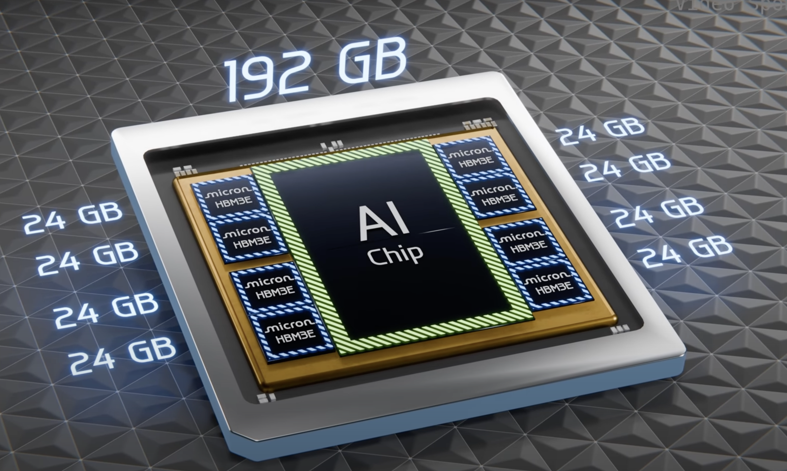

### GPU physcial structure

let's first understand the structure of GPU.

Inside a GPU it has a chip named GA102 (depends on architecture, this is for ampere architecture) built from 28.3million transistors (semiconductor device that can **switch** or **amplify** electrical signals)

and majority area covered by processing cores.

processing core is divide into seven Graphics processing clusters (GPCs)


among each GPC there are 12 Streaming Multiprocessors.

Inside each SM there are 4 warps and 1 Raytracing core

inside a warp there are 32 Cudas and 1 Tensor Core.

Altogether there are

- 10752 CUDA Cores
- 336 Tensor Cores
- 84 Ray Tracing Cores

Each cores have different function.

### Cuda Cores


cuda core is like a basic calculator with multiplication and addition operations.

- Mostly used for processing video frames.
- perform operations like A x B + C called fused multiply and add (FMA)
- half of the cuda cores perform FMA on 32-bit floating point numbers other half perform 32-bit integer FMA.
- other sections perform bit shifting and bit masking as well as collecting and queuing incoming operands, and accumulating output results.
- So it can be though of like a calculator.
- performs one 1 multiply and 1 add operation per 1 cycle
- so altogether 2 operations x 10752 cuda cores x 1.7 GhZ clock speed(10^9 cycles per second) = 35.6 trillion calculations per second.

### Ray tracing Cores


- used for executing ray tracing algorithms

Depending on the amount of streaming multiprocessors that are damaged during manufacturing they are categoriezed and sold at different prices, for instance RTX 3090 ti has full 10752 cuda where as 3090 might have some damaged SMs. These cards might have different clock speed too.

### Graphics Memory GDDR6X SDRAM

these 24GBs of GDDR6X surround the GPU chip
In order to run the operations of GPU chip

- They must be loaded from SSD to these graphics memory.
- They have certain bandwidth i.e the amount of data they can transfer per second to the GPU chip. They have 1.15 Terbytes/sec bandwidth.
- Similar to HBM memory in AI chips, would look something like this
  

### How are operations executed?

- Each instruction is executed by a thread (which is matched to a single cuda core) and these threads are combined into 32 cores called warp, 4 warps are combined to form thread blocks that are operated by Streaming Multiprocessor (SM). Similarly SM is combined together. All these are operated by Gigathread Engine

If processor runs at 1Ghz, it can run 10^9 cycles per second, assuming 1cycle = 1 basic operation it can execute 10^9 operations.

- its basically like a unit of time, 10^9 cycles per 1 second means, one cycle takes 10^-9 seconds to run.
- Different operations take varying amount of cycles (i.e latency of the operation) to perform.

```
- Global memory access (up to 80GB): ~380 cycles
- L2 cache: ~200 cycles
- L1 cache or Shared memory access (up to 128 kb per Streaming Multiprocessor): ~34 cycles
- Fused multiplication and addition, a*b+c (FFMA): 4 cycles
- Tensor Core matrix multiply: 1 cycle
```

### Tensor Cores (Most important)

These cores are used for matrix multiplication and matrix additions.

- predominantly used in deep learning calculation.


First lets start by understanding the precision formats that's used.

#### **1. FP16 (Half-Precision Floating-Point)**

- **Full Name**: Half-precision floating-point.
- **Size**: 16 bits (2 bytes).
- **Bit Allocation**:

  - 1 bit for the sign.
  - 5 bits for the exponent.
  - 10 bits for the mantissa.

- **Precision**: About 3 decimal digits, 2^10 = 1024, taking log10(1024) = 3 decimal digits.

#### **2. FP32 (Single-Precision Floating-Point)**

- **Full Name**: Single-precision floating-point.
- **Size**: 32 bits (4 bytes).
- **Bit Allocation**:
  - 1 bit for the sign.
  - 8 bits for the exponent.
  - 23 bits for the mantissa.
- **Precision**: About 7 decimal digits.

The operation performed by Tensor Core is something like this.

(picture)
It performs 64 FMA operations per clock.

#### Understanding matrix multiplication in tensor cores.

**Task**:

Matrix multiply A and B with each size 32 x 32

lets say our tensor cores process 4x4 matrix multiplications per 1 cycle. The step to multiply A and B are

- divide A and B into tiles of 4x4 matrices i.e 64 4x4 tile for each matrix
- load the tiles into shared memory (164KB) from global memory takes about 200 cycles.
- load the tiles into tensor core registers for operation from shared memory, take about 34 cycles.
- perform matrix multiplication on eight tensor cores all in parallel, take 1 cycle and then accumulate the values.
- total cycle 200+34 + 1 = 235 cycles.

#### Memory Bandwidth

we have seen that Tensor Cores are very fast. So fast, in fact, that they are idle most of the time as they are waiting for memory to arrive from global memory.
 For example, during GPT-3-sized training, which uses huge matrices — the larger, the better for Tensor Cores — we have a Tensor Core TFLOPS utilization of about 45-65%, meaning that even for the large neural networks about 50% of the time, Tensor Cores are idle.

### Nvidia Ampere Architecture

- **108 streaming multiprocessors (SMs)**
- 432 Tensor Cores
- 6,912 FP32 Cuda Cores
- 3,456 FP64 cuda cores
- (they share the same physical hardware, different in a sense that each require different clock speed and precision )

More details in the picture below.


These TFLOPS are calculated using this formula

Number of cores for that precision (FP64) x clock speed x Operations per clock (generally 1FMA or 2 Operations)

- **Tensor Float 32 (TF32)**:
  - **156 TFLOPS | 312 TFLOPS\***: TF32 is a mixed-precision format optimized for AI workloads. It provides a balance between FP16 and FP32 precision.
- **BFLOAT16**:
  - **312 TFLOPS | 624 TFLOPS\***: BFLOAT16 is a 16-bit floating-point format used in deep learning, offering a good trade-off between range and precision.
- **FP16 Tensor Core**:
  - **312 TFLOPS | 624 TFLOPS\***: FP16 is used for deep learning training and inference, providing high throughput for lower-precision computations.
- **INT8 Tensor Core**:
  - **624 TOPS | 1248 TOPS\***: INT8 is used for inference tasks, where lower precision is acceptable, and high throughput is critical.

This figure shows the range and precision of each of these.


Preferred:

- TF32 for training and mostly FP16 and BF16 for inference.

#### How numbers are stored (example of fp16)

lets store **-8764.781267** in FP16 format

first convert int and frac part to binary, we get

(8764.781267)base10≈(10001000111100.110012)base2

Normalize the binary number to the form 1.mantissa x 2^(exponent)

10001000111100.11001​=1.000100011110011001​×2^13

The exponent is biased by **15** in FP16:
i.e Exponent Bits=Actual Exponent+15=13+15=28

(28)base10​=(11100)base2

The mantissa is the fractional part of the normalized number, truncated to **10 bits**:

(1.000100011110011001)base2→(00010001111.000100011110011001)base2​→(0001000111)base2

The number is negative, so the sign bit is:

Sign Bit=1Sign Bit=1

Combine the sign bit, exponent bits, and mantissa bits:

- **Sign Bit:** `1`
- **Exponent Bits:** `11100`
- **Mantissa Bits:** `0001000111`

The FP16 representation is:

11110000010001111111000001000111

​

Tensor cores are optimized for matrix multiplications so it can peform more operations per clock rather than just 64 FMA per clock.

### Sparsity

Matrix contains large number of zeros in it, by using a fine-grained pruning algorithm to compress (essentially removing) small and zero-value matrices, the GPU saves computing resources, power, memory and bandwidth.

### Form Factor

They define how the GPU is physically integrated into a system and how it connects to other components like the CPU and memory.

- **PCIe** is a standard interface used to connect GPUs, SSDs, network cards, and other peripherals to a computer’s motherboard
- **SXM** are not standalone cards and is used in data centers.

| **Bandwidth** | PCIe Gen4: 64 GB/s (x16) | NVLink: 600 GB/s (per GPU pair) |
| ------------- | ------------------------ | ------------------------------- |

### References

- [How do Graphics Cards Work? Exploring GPU Architecture](https://youtu.be/h9Z4oGN89MU?si=3oqaqgIWJMSQAMz3)
- [NVIDIA A100 TENSOR CORE GPU](https://www.nvidia.com/content/dam/en-zz/Solutions/Data-Center/a100/pdf/nvidia-a100-datasheet-us-nvidia-1758950-r4-web.pdf)
