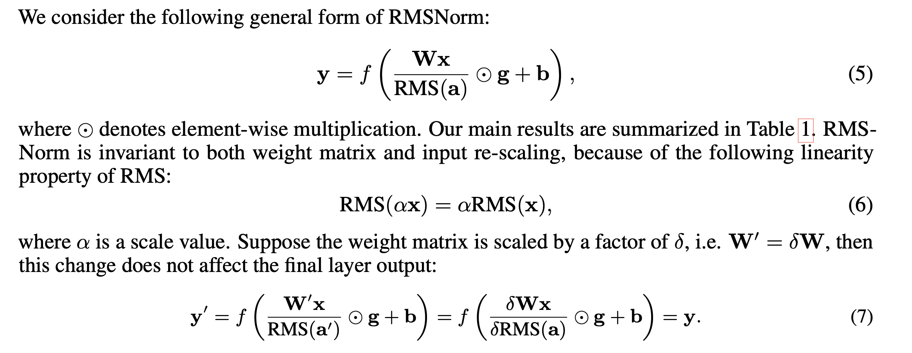

### Recap of LayerNorm

let's first recap by understanding why LayerNorm was used:

- We needed to balance the distribution of inputs (internal covariance shift) i.e we want inputs to be roughly gaussian (mean 0, std 1), it not maintained it would result in zeroing out the gradients.
- output of some blocks (transformer block) may produce large values or very small values that would result in either exploding or vanishing gradient problem, in order to have stable training, we needed to have stable range for those outputs.

In this [paper](https://arxiv.org/pdf/1910.07467), the authors raise concern about LayerNorm.

- it's computationally expensive
  and they claim that
- re-centering (calculating the x - mean) has little impact for stabilization.

they

- completely get rid of mean statistic
- now there is less overhead because we don't have to calculate one extra statistic.

they also provide that RMSNorm is invariant (does not change) to inputs or weights matrices.

which indicates that the change in scale of input of weights doesn't affect the RMSNorm.
