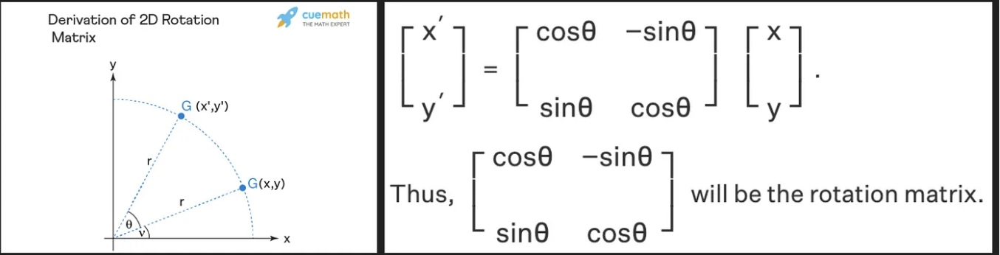
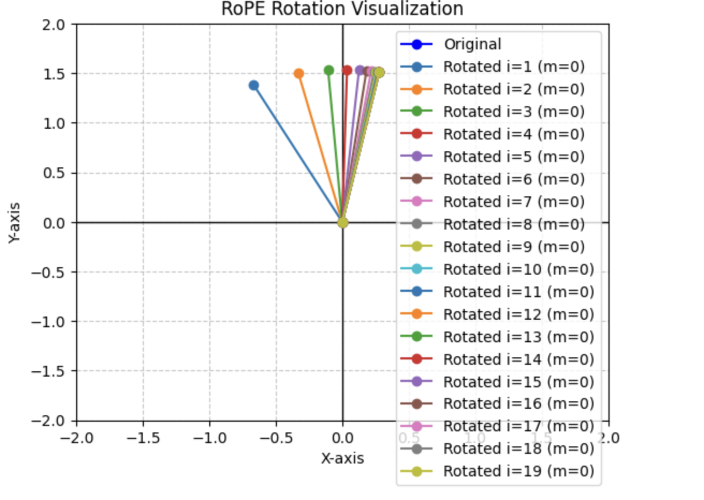
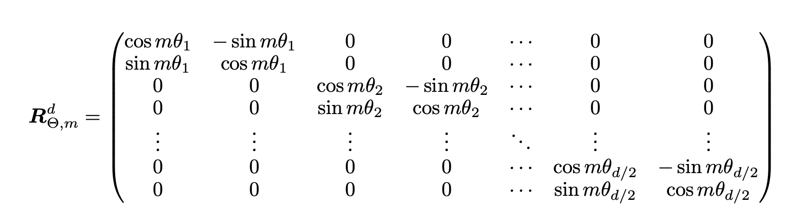
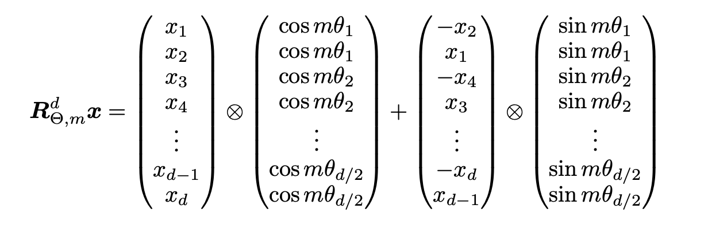
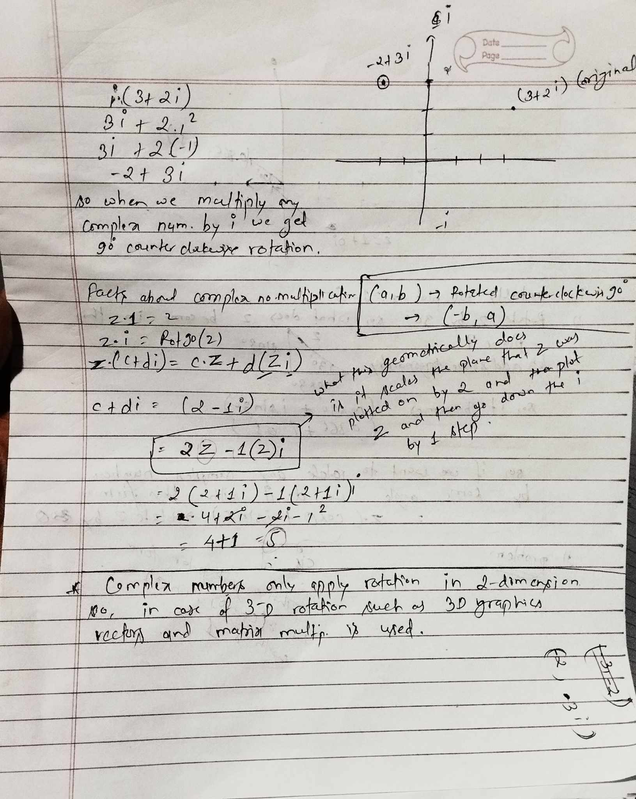
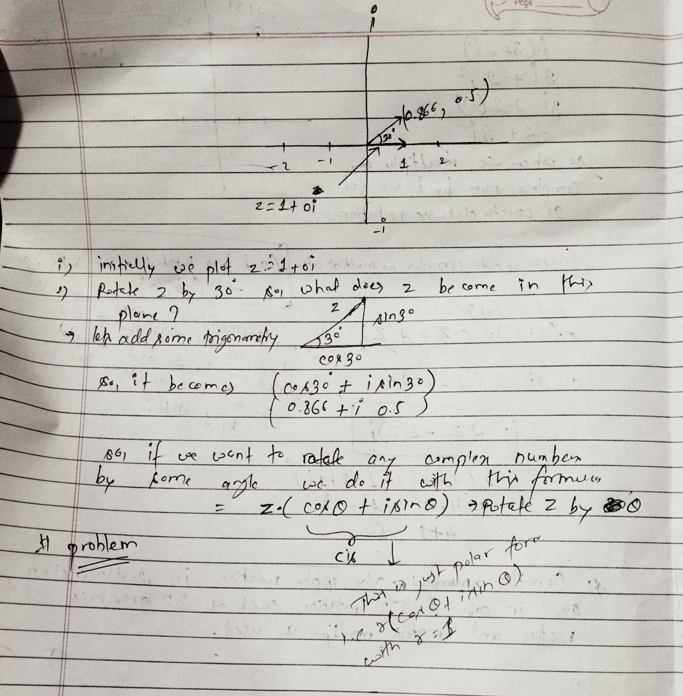
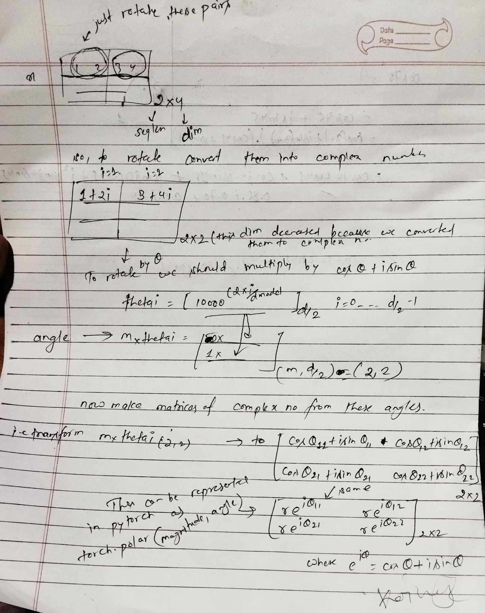

### Recap of Absolute PE

We previously used absolute positional embedding in our GPT-2 model.

#### Disadvantages

- No notion of relative information between tokens
- doesn't work for sequences larger than context length the model is trained with, because we run out of token embeddings for tokens that come at sequence larger than the context length.

### RoPE

#### pre-requisites



This is how we rotate a point by an angel theta in a two dimensional space and this is all we need in RoPE.

In RoPE, the notion of providing a position to a token is by rotating it by some angle.
For instance, if we have a token "this" with an embedding of 2 i.e [0.2782, 1.5109] and lets say it occurs in our sequence at first

```
[this,is,awesome]
```

The idea is to rotate token's embedding according to the position it occurs in our sequence.

For instance, if this occurs in 2nd position it's original embedding ([0.2782, 1.5109]) will be rotated by some angle m x theta, where m is the position and theta is some angle. You can see how we're incorporating information about absolute position of tokens (m) while rotating it.

but the embedding is usually bigger than what we've assumed here, it's basically 256,512,768 depending on what we choose. Let's say we have embedding dimension of 4 for the sake of simplicity. The idea is to first divide embedding dimensions into pairs and apply rotation to each pairs.

```python
d_model = 4
sentence = 'this is awesome'
x = [i for i in range(len(sentence.split(' ')))]

Q = torch.randn(len(sequence), d_model)

Q
```

output

```
		[[ 0.2782,  1.5109,  0.1739, -0.7098],
        [ 0.3792, -0.1098,  0.3707, -0.4049],
        [ 0.1652,  0.5787,  0.4085, -0.7005]]
```

so embedding for our token "this" corresponds to

```
[ 0.2782,  1.5109,  0.1739, -0.7098]
```

it is divided into two i.e i values i.e i = 0 will correspond to [ 0.2782, 1.5109] and i=1 will correspond to[0.1739, -0.7098] so, the i values ranges from 0 to d_model/2 - 1, where d_model is the embedding dimension and and we can apply rotation to each of these separately and combine them together into one single embedding.

the angle by which we rotate a pair depends on m and theta, as m is simply the position and theta is generally this

```
10000 ** (-2 * i / d_model) #where i corresponds to each pair as described above.
```

let's see how embedding of our token "this" is rotated if it occurs at different positions (i.e different m) in this case i'm assuming i=0 (only considering the first pair)

We construct our rotation matrix like this

```python
def rotation_matrix(m, i, d_model):
    """
    Compute the 2x2 rotation matrix for RoPE.

    Args:
        m (int or torch.Tensor): Position (token index).
        i (int or torch.Tensor): Dimension index.
        d_model (int): Embedding dimension.

    Returns:
        torch.Tensor: 2x2 rotation matrix.
    """
    # Compute theta_i
    thetai = 10000 ** (-2 * i / d_model)
    print(thetai)

    # Ensure m is a tensor
    m = torch.tensor(m, dtype=torch.float32)

    # Compute cos(m * theta_i) and sin(m * theta_i)
    angle = m * thetai
    cos = torch.cos(angle)
    sin = torch.sin(angle)

    # Construct the 2x2 rotation matrix
    rotation_matrix = torch.tensor([
        [cos, -sin],
        [sin, cos]
    ])

    return rotation_matrix
```

and apply this rotation for different m values(different positions) i.e 1,2,3,4,5

```python

# Input vector
inp = Q[0,:2].detach().numpy() # [ 0.2782,  1.5109]

# Create a figure and axis
plt.figure()

# Draw the coordinate axes
plt.axhline(0, color="black", linewidth=1)  # X-axis
plt.axvline(0, color="black", linewidth=1)  # Y-axis

# Set axis limits
plt.xlim(-2, 2)
plt.ylim(-2, 2)

# Plot the original input vector
plt.plot([0, inp[0]], [0, inp[1]], color='blue', label='Original', marker='o')

# Apply rotation and plot the rotated vectors
for m in range(1, 5):
    # Compute the rotation matrix
    rot_mat = rotation_matrix(m, 0, d_model)

    # Apply the rotation to the input vector
    ans = rot_mat @ inp

    # Plot the rotated vector
    print(ans)
    plt.plot([0, ans[0]], [0, ans[1]], label=f'Rotated (m={m})', marker='o')


# Add labels and title
plt.xlabel("X-axis")
plt.ylabel("Y-axis")
plt.title("RoPE Rotation Visualization")

# Add a legend
plt.legend()

# Add a grid
plt.grid(True, linestyle="--", alpha=0.7)

# Display the plot
plt.show()
```


you can see how these are rotated by some big angles when m is changed.

but this isn't the case for later embedding pairs (i.e i = 300, when d_model = 768).

The more we increase our i values the less angle it will rotate with. Lets see one example
I'm keeping the value of m as a constant i.e 1 here and plotting for different i values for sample input embedding.

```python

inp = Q[0,:2].detach().numpy()


# Create a figure and axis
plt.figure()

# Draw the coordinate axes
plt.axhline(0, color="black", linewidth=1)  # X-axis
plt.axvline(0, color="black", linewidth=1)  # Y-axis

# Set axis limits
plt.xlim(-2, 2)
plt.ylim(-2, 2)


# Plot the original input vector
plt.plot([0, inp[0]], [0, inp[1]], color='blue', label='Original', marker='o')

#Apply rotation and plot the rotated vectors
for i in range(1, 20):
    # Compute the rotation matrix
    rot_mat = rotation_matrix(1,i , 40)

    # Apply the rotation to the input vector
    ans = rot_mat @ inp

    # Plot the rotated vector
    print(ans)
    plt.plot([0, ans[0]], [0, ans[1]], label=f'Rotated i={i} (m={0})', marker='o')

# Add labels and title
plt.xlabel("X-axis")
plt.ylabel("Y-axis")
plt.title("RoPE Rotation Visualization")

# Add a legend
plt.legend()

# Add a grid
plt.grid(True, linestyle="--", alpha=0.7)

# Display the plot
plt.show()
```



as you can see the angle between them becomes smaller and smaller when I is increased.

NOTE: In the figure above our original plot (dark blue) lies in the same pos as the plot covered by i=19.

I just wanted to show how angles change depending on m and i values.

Now that we have basic intuition, lets implement it.

rotating a embedding of dimension 2 is simple, but how do we do it for more than 2 dimension in just one operation?

here's how.

we construct matrix like this where the diagonal is rotation matrix (same matrix that we used above) and all the other elements are sparse i.e 0 and then multiply this big rotation matrix with our embedding of size d.

But the authors of this paper have derived a simple formula for doing the same operation but without the big matrix, because it would be computationally expensive where most of the elements are sparse.

here's the simplified formula.


lets apply this simplified version to our token "this" where it's embedding is [ 0.2782, 1.5109, 0.1739, -0.7098]

NOTE: this code below only applies the rotation to token "this" only for simplicity. m=0 because it occurs at position 0.

If you take a closer look the code below, it matches the formula shown above.

```python
m = 0
cos_dim = [math.cos(m*(10000**(-2*i/d_model))) for i in range(d_model//2) for _ in range(2)]
sin_dim = [math.sin(m*(10000**(-2*i/d_model))) for i in range(d_model//2) for _ in range(2)]

QT = torch.empty_like(Q[0])

QT[1::2] = Q[0][::2]
QT[::2] = -Q[0][1::2]

simplified_ans = Q[0]*torch.tensor(cos_dim) + QT*torch.tensor(sin_dim) # using m

```

This code below applies the rotation to all 3 tokens in our sequence for all i values.

```python
thetai = 1.0 / (10000 ** (2*torch.arange(0, d_model//2).float() / d_model))

m = torch.arange(Q.shape[0], dtype=torch.float)
sinusoid = m.unsqueeze(1) * thetai.unsqueeze(0)  # Outer product

freq = sinusoid.repeat_interleave(2,dim=1)

cos= torch.cos(freq)
sin = torch.sin(freq)
Q_new = torch.empty_like(Q)

Q_new[:,::2] = -Q[:,1::2]
Q_new[:,1::2] = Q[:,::2]

ans = Q*cos + Q_new*sin
```

all these code were for matrix rotation. But there's more to it.

llama models don't use these type of operation, because there seems to be too much tensor manipulation is a bit computationally expensive. There seems to be an elegant way of doing 2D rotation, and that is by using complex numbers.

Before going into the implementation, please read these paper notes.

Complex plane is simply representing real numbers along the x-axis and imaginary numbers along y (i.e imaginary plane is perpendicular to the real plane)





after completely understanding the notes, now we you may have the notion that we can represent our embedding in complex numbers and then multiply by cos(theta) +i.sin(theta)
to rotate it by theta.

what we do now in the code below is represent our input in complex form, and represent the rotation angles in polar form and then multiply together to get the output.

```python
def precompute_freq_cis(dim, end, theta = 10000):

    thetai = 1.0 / (theta ** (torch.arange(0, dim, 2)[: (dim // 2)].float() / dim))
    m = torch.arange(end, device=thetai.device)
    mthetai = torch.outer(m,thetai) # m x thetai

    return torch.polar(torch.ones_like(mthetai),mthetai) # computes r * e^mthetai


def apply_rotary_pe(xq, xk, cis):

    def unite_shape(pos_cis, x):
        ndim = x.ndim
        assert 0 <= 1 < ndim
        assert pos_cis.shape == (x.shape[1], x.shape[-1])
        shape = [d if i == 1 or i == ndim - 1 else 1 for i, d in enumerate(x.shape)]
        return pos_cis.view(*shape)

    xq_ = torch.view_as_complex(xq.view(*xq.shape[:-1],-1,2)) # converting to complex form
    xk_ = torch.view_as_complex(xk.view(*xq.shape[:-1],-1,2)) # converting to complex form
    cis = unite_shape(cis,xq_)
    xq_out = torch.view_as_real(xq_ * cis).flatten(3)
    xk_out = torch.view_as_real(xk_ * cis).flatten(3)

    return xq_out.type_as(xq), xk_out.type_as(xk)


```

```python
freq_cis = precompute_freq_cis(4,3)
xq = torch.randn(5,3,2,4)
xk = torch.randn(5,3,2,4)

xq_out, xk_out = apply_rotary_pe(xq,xk,freq_cis)
```

This is how it's originally implemented in llama models as you can see here

https://github.com/meta-llama/llama/blob/8fac8befd776bc03242fe7bc2236cdb41b6c609c/llama/model.py#L132

### References

- [https://arxiv.org/pdf/2104.09864](https://arxiv.org/pdf/2104.09864)
- [RoPE](https://youtu.be/GQPOtyITy54?si=VBH6Vnnsykmv9BaQ)
- [Complex Numbers Fundamentals](https://www.youtube.com/watch?v=5PcpBw5Hbwo)
- [llama code implementation](https://github.com/meta-llama/llama/tree/main)
