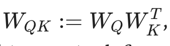
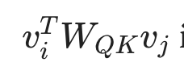
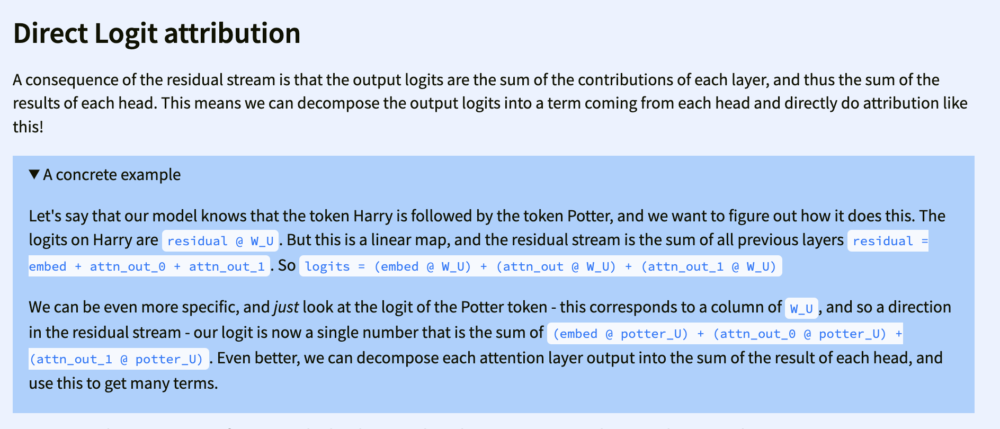
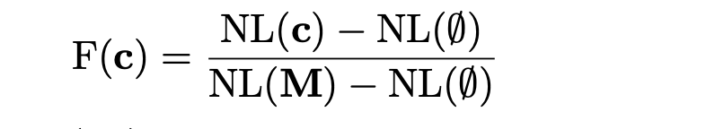

### Induction circuits

**Induction behaviour**
The task of detecting and repeating subsequences in a text by finding some patterns.

For example: If there exist a text containing name "James Bond" and later in the text when the model sees the word "James" it predicts/repeats the word "Bond" because it's already seen the words "James Bond" and analyzes that "bond" should come after the word "James". Also called "Strict Induction"

**Induction head**
A head which implements the induction behaviour. They allow models to perform in-context learning (ICL).

### QK circuit

Wq, Wk, Wv be the projection matrices in our attention and Wo be the projection matrix in attention.

Wq,Wk, Wv can be thought of as what we take in(read) from the residual stream and Wo can be though of as what we put into(write) the residual stream. Similar to read/write operation.

QK circuit is represented as combination of


and attention scores are calculated as


it is similar to Q @ K.T

Conceptually, this matrix tells us **which tokens information is moved to & from** in the residual stream.

### OV circuit


- Conceptually, this matrix (Vi.Wov) tells us **what information is moved from a token**, if that token is attended to.

**Some prerequisites**

**orthogonal subspace**
Important assumption to keep in mind is subspaces are orthogonal i.e their dot product is 0, which means, we can decompose a vector into different subspaces that can have independent meaning because of this assumption.

A simple example is when we add the positional embedding and vector embedding initially,

output = positional embedding + vector embedding

we are simply adding two different informations from different subspaces i.e positional embedding and vector embedding, and if they are orthogonal, we can independently pluck out their embeddings from the output.

**K-composition**
In K-composition, the output of one attention at layer 0 is used as a key for another attention calculation in layer1.


Induction heads are responsible in significant downward loss. It could mainly occur in phase changes, eg. 2B to 4B tokens. Are responsible to ICL but also helps in translation as well as few-shots learning

### Visualization of induction head


the visualization would look like this, for an induction head i.e the destination token attends to token after the previous destination token's occurance offset by seq_len - 1.

### Direct logits attribution



It involves understanding how much each component (e.g., attention heads, layers, or direct paths) contributes to the model's predictions.

Using attention head pattern is not enough to deduce that the model is actually using that attention information, to finally verify we also have to see their direct logits attribution, i.e how much their RS contribute to the final logits.

### Ablation

Zeroing activation is not recommended because it completely moves the model's representation out of distribution. Instead, mean over some batch dimension is recommended.

### Making sense of induction circuits in terms of QK, OV circuits

source token: the token that is being attended to
destination token: the token that is looking at other tokens

lets say we process a random but repeating sequence.

```
['<|endoftext|>', 'anguage', ' reign', 'ای', ' aides', ' freight', ' Break', ' compete', ' Ment', '··', ' vaginal', ' burn', '을', 'Connell', ' affiliates', 'Back', 'Trigger', ' blade', 'ų', ' emotion', ' Ash', ' rupture', 'ian', ' pickup', ' Theresa', ' creepy', ' libert', 'uclidean', ' repairs', 'ylvan', 'τή', ' playwright', ' decou', ' deliver', ' Steele', '70', ' employing', 'idopsis', 'hidden', ' Ren', 'UTR', ' morale', ' vacant', ' _(', ' contra', 'ィ', ' vocals', ' reduces', 'Civil', 'ussion', ' deeds', 'anguage', ' reign', 'ای', ' aides', ' freight', ' Break', ' compete', ' Ment', '··', ' vaginal', ' burn', '을', 'Connell', ' affiliates', 'Back', 'Trigger', ' blade', 'ų', ' emotion', ' Ash', ' rupture', 'ian', ' pickup', ' Theresa', ' creepy', ' libert', 'uclidean', ' repairs', 'ylvan', 'τή', ' playwright', ' decou', ' deliver', ' Steele', '70', ' employing', 'idopsis', 'hidden', ' Ren', 'UTR', ' morale', ' vacant', ' _(', ' contra', 'ィ', ' vocals', ' reduces', 'Civil', 'ussion', ' deeds']
```

We pass it through our 2 layer attention-only model

we get attention pattern like this for layer 0 
here 7 is a **previous token head**

and we get this attention pattern for layer 1


4 and 7 are induction heads, cause we see the activations for seq_len -1 diagonal

So what we can conclude from this is that OK circuit from attention head no 7 in layer 0 always attends to the previous token, OV circuit from the same head writes the previous token information in the embedding subspace.

In layer 1, attention 4,10, K-composition is used i.e the output of attention head 7 is used as the key in these attentions, the QK circuit looks at the source token whose previous token is the destination token (i.e current token) and OV circuits writes this information in the embedding subspace (i.e info about which tokens come next).

**NOTE** decomposition trick only works for things that are linear, it would work if there are no activation functions eg, ReLU, GeLU. or would only work before softmax, rather than after softmax.

## A Mathematical Framework for Transformer Circuits

**Key takeaways**

- Residual stream (RS) can be thought of sum of changes added by each layer (embedding, attention, MLP)
- The residual stream has a deeply linear structure.
- dimensions of the residual stream become something like "memory" or "bandwidth"
- Why do we decompose residual stream and study them independently? because they try to communicate in superposition. Meaning, a residual stream only has limited dimensions eg 512 and at MLP it has to interact with a lot more dimensions i.e 4Xmore dimension than it has space on it. So its better to study them independently. So the RS has very high demand, is the reason why some info gets deleted and some added by some layers.
- Attention heads copy information from the residual stream of one token to the residual stream of another. They typically write
  to a different subspace than they read from.
-

### Paper

implement this formula to find which component/layer are important 

to find how good they are (faithful) use this equation



IDENTIFYING ANSWER-PROMOTING COMPONENTS
train linear probing for each layer, at each position p, find which which layer at which position promote the correct-answer

DECOMPOSING CIRCUIT MLPS TO INDIVIDUAL NEURONS

Go more deep into the MLP to see which neurons promote arithmetic calculation

do activation patching on neurons.

they find > neurons with the highest effect are different between operators.

only 200 neurons (roughly 1.5%) per layer are needed to achieve high faithfulness and correctly compute arithmetic prompts.

among top 200 they examine neurons, by hypothesizing that 1. their key denotes the activation patterns, and 2. their values encodes the correct output in these dimension.

Approach

Our Hypothesis: Circuits for Math Reasoning only work for similar problems (i.e the patterns/distributions LLMs encoded in their weights during their training) and circuits fail when they receives problems that require calculation which is out-of-distribution.

The hypothesis is to basically prove why LLMs are not robust in Math Reasoning.

Steps to prove:

1. Find circuits of LMs responsible for Math Reasoning/Calculations for correct output ( i.e we find circuit for problems which LMs can solve and ignore the problems on which they fail) using patching. (calculating indirect effect (IE) as done in this paper https://arxiv.org/pdf/2305.15054)
2. We can go further and find specific neurons responsible for calculations by finding the top-k tokens for specific neurons and patching/ablating them to find if they're really important. However, I believe we can limit experiment to til finding the circuits as mentioned in step 1.
3. Generate adversarial math problems (i.e out of distribution problems ). We can simply opt for M2 level problems as done in this paper (https://arxiv.org/pdf/2402.17916)
4. Test those adversarial problems on LMs, filter and keep only the problems on which LMs produce incorrect output and study their whole output ( which should also include their step-by-step reasoning)

for example:

**Prompt**:

Chenny is 64 years old. Alyana is 54 years younger than Chenny. How old is Anne if she is 55 years older than Alyana?

LM output:

To determine Anne's age, we need to follow these steps:

1. Calculate Alyana's age.
2. Use Alyana's age to find Anne's age.

**Step 1: Calculate Alyana's age.** Chenny is 64 years old. Alyana is 54 years younger than Chenny. So, Alyana's age is: \[ 64 - 54 = 100 \]

**Step 2: Calculate Anne's age.** Anne is 55 years older than Alyana. So, Anne's age is: \[ 100 + 55 = 155 \] Thus, Anne is \(\boxed{155}\) years old.

5. Analyze the point where there is error in calculation, i.e there was error in `\[ 64 - 54 = 100 \]` in the LM's output above.
6. We hypothesize here that the mistake in calculation was because the circuits lacks patterns/ heuristics to solve the problem. The concept about patterns/heuristics can be found in this recent paper (https://arxiv.org/pdf/2410.21272). To elaborate, while training it was able to encode this pattern/ heuristics that 5-4 = 1 in their weights, but it cant perform 65 - 54 because it lacks those patterns/heuristics.
7. We can prove our hypothesis to be true here, if we can supply it with the necessary pattern/heuristics. To do so,
8. We run the LMs with our prompt new prompt.

PROMPT:

Chenny is 64 years old. Alyana is 54 years younger than Chenny. How old is Anne if she is 55 years older than Alyana?

To determine Anne's age, we need to follow these steps:

1. Calculate Alyana's age.
2. Use Alyana's age to find Anne's age.
   **Step 1: Calculate Alyana's age.** Chenny is 64 years old. Alyana is 54 years younger than Chenny. So, Alyana's age is: \[ 64 - 54 = 10

as you can see our new prompt is **previous prompt + the LM's output til the point where LMs get calculations wrong**
but we manually correct the calculation, example 64 - 55 = 100 was corrected to 64 - 55 = 10,

and we get the activations for this new prompt by only generating the activations for only 1 new sequence (meaning we don't let it complete the whole sequence, the point is to just get activations till the point where it gets wrong) , and then patch the circuit activations from this new corrected run to the old run where it got it wrong.

Now, if the old run is able to get the answer right after the patching process, it's very likely that it lacked the necessary pattern/heuristics for solving that problem.

The bottleneck/time consuming thing would be manually identifying the point in the LM's output where it has error and correcting it.

logit difference

The metric also is a mostly linear function of the residual stream (unlike probability-based metrics) which makes it easy to directly attribute logit difference to individual components (“direct logit attribution”, “logit lens”).

Probabilities: This metric measures the probability of the right answer, or the difference in probabilities of different answers. The main issue with such metrics is Probabilities are non-linear, in the sense that they track the logits ~exponentially. For example, a model component adding +2 to a given logit can create a 1 or 40 percentage point probability increase, just depending on what the baseline was. As an example of the non-linearity consider the orange line in the figure above: A modest increase in logit difference around layer 17 converts to a jump in probability. Probabilities also inherit the problems of the logprob metric, namely saturation and unspecificity. The figure shows the saturation effect for the orange line at layer >18.

TLDR: probability is exponential we can't attribute model component's work to prob change completely.

I would like to tell you the update about the work that did in past 2 weeks.

In the first week, I was involved in reading the paper that you sent me. I've attached slides for those paper which is attached in this email. Afterwards, I did some experimentation of the basics of Mechanistic Interpretability such as probing, logits lens and ablation using TransformerLens library, then I studied how induction, QK and OV circuits work, and some detail about K composition.

In the second week, I started experimentation by looking into neurons to see if I can find specific neurons that are responsible for math reasoning. I used few samples from GSM8K dataset. I was able to find specific neurons responsible for

### Direct effect

measuring how patching/ablation affects the logits directly

### Indirect effect

measuring how patching/ablation affects the logits indirectly, for example: patching one attention layer might not contribute directly to logits but may interact with further attention layer, it kind of a chain effect. Hard to measure.

### Logit difference

logit differnce is easier to understand

logit difference == logprob difference


### Things to check

- Compute the likelihood of the input "22 + 78 =" under the model's probability distribution.
- Compare this likelihood to the likelihood of known in-distribution examples.
- If the likelihood is significantly lower, the input might be OOD.

We can also check if the number is deleted by ffn or by the composition.

- See all the logit lens of residual network and also the logit lens of ffn and see if it deletes, See ffns are kv memories paper in the end.

#### References

https://dynalist.io/d/n2ZWtnoYHrU1s4vnFSAQ519J#z=_Jzi6YHRHKP1JziwdE02qdYZ
https://www.lesswrong.com/posts/TvrfY4c9eaGLeyDkE/induction-heads-illustrated

best practices for patching https://arxiv.org/pdf/2309.16042
