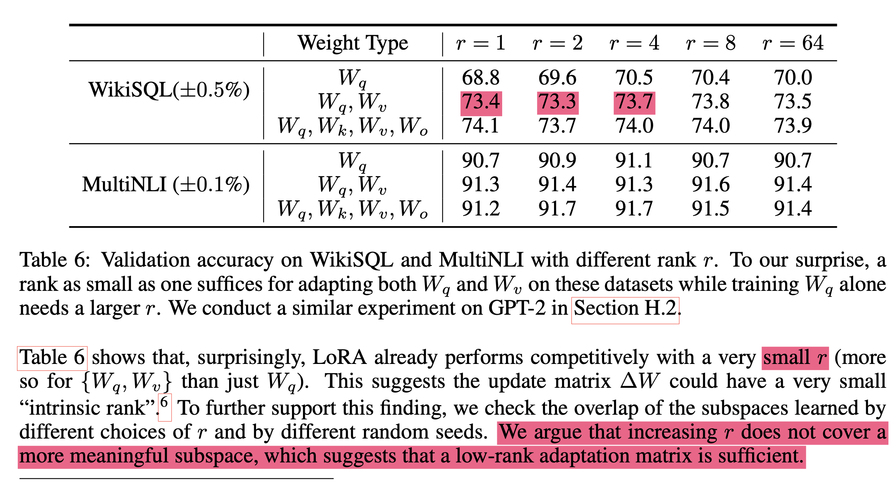

### LoRA

Main idea is to approximate the change in weights dW by the use of low-rank matrices

Eg: Usually the weight update is done by adding the change in weights dW to the original weight matrix W. dW is obtained through backpropagation, ex if W is 512 x 512 the parameter size of dW is 262,144.

In LoRA, we approximate that dW but by breaking down into two low rank matrices B @ A where B = matrix of size 512 x r and A = matrix of size r x 512,

previously if the forward pass was like this

out = X @ W

we change the forward pass:
out = X @ W + X @ B@A

we freeze all the other parameters (W in this case), and only find gradients for B,A and update only these weights.

First lets implement toy example that approximates sin function, we implement manual backpropagation so that It'll be easier to understand what gets updated in our LoRA implementation.

### Paper findings (only focus on highlighted sentences)




```python

# import torch
import torch.nn as nn
import numpy as np
import matplotlib.pyplot as plt

# Generate synthetic data (sine wave)
X = np.linspace(0, 2*np.pi, 100).reshape(-1, 1)
y = np.sin(X)

# Convert to PyTorch tensors
X_tensor = torch.tensor(X, dtype=torch.float32)
y_tensor = torch.tensor(y, dtype=torch.float32)

# Define a small MLP
class MLP(nn.Module):
    def __init__(self):
        super().__init__()
        self.layers = nn.Sequential(
            nn.Linear(1, 20, bias = True),  # 1 input → 10 hidden
            nn.ReLU(),
            nn.Linear(20, 1, bias = False)    # 10 hidden → 1 output
        )

    def forward(self, x):
        return self.layers(x)

# Initialize model, loss, and optimizer
model = MLP()
criterion = nn.MSELoss()
# optimizer = torch.optim.Adam(model.parameters(), lr=0.01)

# Training loop
epochs = 5000
for epoch in range(epochs):
    optimizer.zero_grad()

    #Instead of this forward pass
#     outputs = model(X_tensor)

    # Implement this forward to manually do the forward pass
    o1 = X_tensor @ model.layers[0].weight.T
    o2 = o1 + model.layers[0].bias
    o3 = model.layers[1](o2) # relu layer
    outputs = o3 @ model.layers[2].weight.T


    diff = outputs - y_tensor
    squared_diff = diff**2
    o_seven = squared_diff.sum(0)
    loss = o_seven/len(squared_diff)

    #clear all the gradients
    for p in model.parameters():
        p.requires_grad = True
        p.grad = None

    for p in [loss, o_seven, squared_diff, diff, outputs, o3, o2, o1, X_tensor]:
        if not p.requires_grad:
            p.requires_grad = True
        p.retain_grad()


    loss.backward()


    ### Manual backpropagation
    dL = torch.tensor(1.0)
    do_seven = dL*1/(len(squared_diff))
    dsquared_diff = do_seven*torch.ones_like(squared_diff)
    ddiff = dsquared_diff * 2*diff
    doutputs = ddiff*1

    do3 = doutputs@ model.layers[2].weight
    dl2w = o3.T @ doutputs
    mo2 = o2 > 0
    do2 = do3 * mo2
    do1 = do2
    dl0bias = do2.sum(0)
    dl0w = X_tensor.T @ do1


# #     cmp('dL', dL, loss)
#     cmp('do_seven', do_seven, o_seven)
#     cmp('dsquared_diff', dsquared_diff, squared_diff)
#     cmp('ddiff', ddiff, diff)
#     cmp('doutputs', doutputs, outputs)
#     cmp('do3', do3, o3)
#     cmp('dl2w', dl2w.T, model.layers[2].weight)
#     cmp('do2', do2, o2)
#     cmp('dl0bias', dl0bias, model.layers[0].bias)
#     cmp('do1', do1, o1)
#     cmp('dl0w', dl0w.T, model.layers[0].weight )


    with torch.no_grad():
        lr=0.01
        model.layers[0].weight.data -= lr*dl0w.T
        model.layers[0].bias.data -= lr*dl0bias
        model.layers[2].weight.data -= lr*dl2w.T


#     optimizer.step()
    if epoch % 100 == 0:
        print(f'Epoch {epoch}, Loss: {loss.item():.4f}')

# Plot results
with torch.no_grad():
    predictions = model(X_tensor).numpy()
plt.scatter(X, y, label='True')
plt.scatter(X, predictions, label='Predicted', color='red')
plt.legend()
plt.show()
```

Now, we implement LoRA.
Here we,

- construct parameters A, B when B@A the resulting matrix size matches layer 0's weight matrix
- modify forward pass by adding `lora_w`
- continue other forward passes as they were previously,
- We don't find the gradients for weights and don't update those matrices, which is essentially freezing
- through intermediate gradients find the gradients for B and A and only update those weights.
- that's it!!!!

```python


# Training loop
epochs = 100000

# lets only train only the lora parameters for layer0's weight
d,k = model.layers[0].weight.T.data.shape
r = 8
B = nn.Parameter(torch.zeros((d,r)))
A = nn.Parameter(torch.randn((r,k)))
scale = 2


for epoch in range(epochs):

    # Implement this forward to manually do the forward pass
    o1 = X_tensor @ model.layers[0].weight.T
    ## add lora part for the layer0's model weight here

    lora_w = scale*B@A
    lora_o1 = X_tensor @ lora_w # size of B@A should match model.layers[0].weight.T i.e (1,20)
    h = o1 + lora_o1

    o2 = h + model.layers[0].bias
    o3 = model.layers[1](o2) # relu layer
    outputs = o3 @ model.layers[2].weight.T


    diff = outputs - y_tensor
    squared_diff = diff**2
    o_seven = squared_diff.sum(0)
    loss = o_seven/len(squared_diff)

    #Freeze all the model parameters
    for p in model.parameters():
        p.requires_grad = False
        p.grad = None
        A.grad = None
        B.grad = None

    for p in [loss, o_seven, squared_diff, diff, outputs, o3, o2, o1, X_tensor, h, lora_o1, lora_w]:
        if not p.requires_grad:
            p.requires_grad = True
        p.retain_grad()


    loss.backward()


    ### Manual backpropagation
    dL = torch.tensor(1.0)
    do_seven = dL*1/(len(squared_diff))
    dsquared_diff = do_seven*torch.ones_like(squared_diff)
    ddiff = dsquared_diff * 2*diff
    doutputs = ddiff*1

    do3 = doutputs@ model.layers[2].weight
    # We freeze this weight
#     dl2w = o3.T @ doutputs

    mo2 = o2 > 0
    do2 = do3 * mo2

    dh = do2
    do1 = dh
    dlora_o1 = dh

    dlora_w = X_tensor.T @ dlora_o1
    dB = scale * dlora_w@A.T
    dA = scale * B.T@dlora_w

    # And we freeze these weights too
#     dl0bias = do2.sum(0)
#     dl0w = X_tensor.T @ do1


#     cmp('dL', dL, loss)
#     cmp('do_seven', do_seven, o_seven)
#     cmp('dsquared_diff', dsquared_diff, squared_diff)
#     cmp('ddiff', ddiff, diff)
#     cmp('doutputs', doutputs, outputs)
#     cmp('do3', do3, o3)
# #     cmp('dl2w', dl2w.T, model.layers[2].weight)
#     cmp('do2', do2, o2)
#     cmp('dh', dh, h)
#     cmp('do1', do1, o1)
#     cmp('dlora_o1', dlora_o1, lora_o1)
#     cmp('dlora_w', dlora_w, lora_w)
#     cmp('dB', dB, B)
#     cmp('dA', dA, A)


#     cmp('dl0w', dl0w.T, model.layers[0].weight )


    with torch.no_grad():
        lr=0.001
        A.data -= lr * dA
        B.data -= lr * dB


#     optimizer.step()
    if epoch % 100 == 0:
        print(f'Epoch {epoch}, Loss: {loss.item():.4f}')

# Plot results
with torch.no_grad():
    predictions = model(X_tensor).numpy()
plt.scatter(X, y, label='True')
plt.scatter(X, predictions, label='Predicted', color='red')
plt.legend()
plt.show()
```
