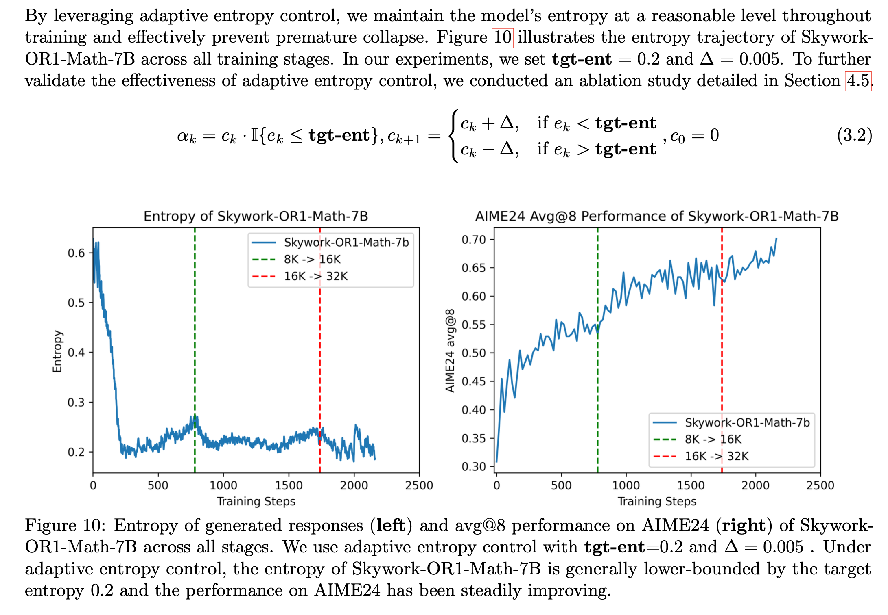
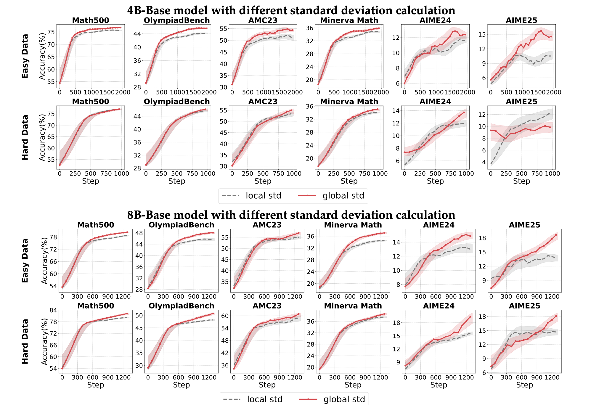

### Skywork Open Reasoner 1 Technical Report

#### Multi-stage training

First, set context_length = T, train, wait for convergence, at some point afterwards set context_length=2T

There seems to be no problem with truncated responses, cause actor learns to produce accurate but shorter responses.

#### High temperature Sampling

temperatue 1.0 provides more room for exploration, whereas lower temperature might cause early entropy collapse.

#### Adaptive Entropy Control

turn off entropy coefficient when entropy is already greater than target entropy else, increase it by del.

### AceReason-Nemotron 1.1: Advancing Math and Code Reasoning through SFT and RL Synergy

#### Which one results in better performance ? large no. of unique prompts or more responses per prompt.

Generally, large no. of unique prompts is better, but at some point obtaining those become difficult, afterwards, we can include more responses per prompt in our dataset. More epochs helps as well.

#### Is stage-1 necessary?

stage-1 training seems to be necessary cause, it allows the model to compress it's reasoning at early stage, not doing so results in accuracy that plateaus see fig below.

#### Exploration vs exploitation (i.e temperature controlled entropy)

extremely high temp or low temp cause reward to dampen, thus noisy training.

#### with overlong filtering or without overlong filtering

with overlong filtering = don't use the trajectory for reward calculation
without overlong filtering = use the trajectory and provide negative reward for truncated responses

overlong filtering helps during first stages (i.e when context lengths are small) otherwise, when context length is sufficient, it doesn't help.

#### Performance with increase in K value (pass@K)

The performance gain decreases for some benchmarks(AIME25) as we increase K. We can find answer within the SFT model if the K is sufficiently large

### Something

#### which one's better? group normalization (GRPO), batch normalization (use same equation as GRPO but taken mean and std between whole rollout batch)

- group normalization seems to be better.

#### Do we need std normalization?

when problems are too easy for actor, the rewards are almost all correct, the std will be low, division by low std results in high advanrages causing higher gradients (sometimes exploding gradients) but when problems are medium-hard there's not much of a difference between normalizing by std or just simply subtracting the mean from the reward. (i.e no use of std)

#### Reward shaping works best when use divide by global std

#### LitePPO

simply using token-level loss i.e sum all tokens loss then divide by total tokens in the batch and using division by global std improves the overall performance.

# FOR SOP

### Writing zero

train pairwise GenRM,

1. Gather pairwise data
2. pass claude code with those pairwise data, generate critiques and final answer.
3. remove the trajectories which has contradictory answer or doesn't match the ground truth (we already know the real preferences)
4. do cold-start SFT with those trajectories.
5. do GRPO training with Reward = 1 if Sc > Sr

afterwards,
do BRPO (modified GRPO) i.e a model will try to generate best answers.
exp do rollout of 8 exp, select one randomly as a reference data, pass current answer and the reference answer to GenRM, GenRM provides scores S1,S2. If R = 1 if S1 > S2 else -1. thats it.

### Next story generation

simply train the reasoning model not the generation model. i.e learn to generate intermediate p_hat, do this using GRPO, reward given by this formula ![[Screenshot 2025-10-13 at 11.48.44 AM.png]]

I is given by this formula
![[Screenshot 2025-10-13 at 11.49.14 AM.png]]

reminder, we need the ground truth answer for training, and PPL simply mean that we find the avg of negative log likelihood of all the tokens and exponentiate that avg and put - sign in front.

[Beyond Verifiable Rewards: Scaling Reinforcement Learning for Language Models to Unverifiable Data](https://arxiv.org/pdf/2503.19618)

https://chatgpt.com/share/68ecbaf2-35e4-800c-8dcf-db3b183741ed

Given a prompt x, the intuitive role of chain-of-thought is such that it makes the marginal likelihood of the ground truth answer a∗ higher. As such, we can interpret chain-of- thought as a latent variable and formulate the optimization of chain-of-thought as latent variable modeling
![[Screenshot 2025-10-13 at 2.23.40 PM.png]]

the first term promotes CoT chains that produce best answer, whereas the second term promotes answer given the CoT chain, third term is simply the KL term.

So it's kind of like providing the implicit rewards using RL + SFT

in
